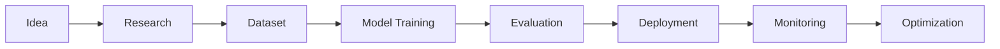

<!-- ========================================================= -->
<!--                 ARPIT SINGH GITHUB PROFILE                -->
<!-- ========================================================= -->

<div align="center">


<br>


</div>

---

<div align="center">


</div>

---

#  Hello World

```bash
root@arpit:~$ whoami
```

```text
Name        : Arpit Singh

Role        : Artificial Intelligence Engineer

Education   : B.Tech Artificial Intelligence

University  : Invertis University

Location    : India

Status      : Building Intelligent Systems

Focus       : Machine Learning | Generative AI | Data Analytics

Experience  : AI Projects | Analytics | Full Stack AI

Mission     : Creating AI products that solve real-world problems.
```

---

#  AI SYSTEM STATUS

```text
██████████████████████████████████████████████████████

SYSTEM STATUS

✔ Artificial Intelligence

✔ Machine Learning

✔ Deep Learning

✔ NLP

✔ Computer Vision

✔ Data Analytics

✔ Cloud Computing

✔ Open Source

SYSTEM HEALTH

██████████████████████████████████████████████████████

CPU Usage          ██████████████░░ 92%

Python             ███████████████ 100%

TensorFlow         ███████████████ 100%

GitHub             █████████████░░ 95%

Coffee             ███████████████ 100%

Learning           ███████████████ 100%
```

---

# 🚀 About Me


```yaml
Name: Arpit Singh

Role: AI Engineer

Specialization:
  - Machine Learning
  - Deep Learning
  - Generative AI
  - NLP
  - Computer Vision
  - Data Analytics

Programming:
  - Python
  - SQL
  - Java

Libraries:
  - TensorFlow
  - PyTorch
  - Scikit-Learn
  - Pandas
  - NumPy
  - OpenCV

Cloud:
  - AWS
  - Azure

Database:
  - MongoDB
  - MySQL

Current Goal:
  Build production-ready AI systems
```

---

# 💻 Hacker Console

```console
root@arpit:~$

$ python ai_portfolio.py

Loading Python................. OK

Loading TensorFlow............ OK

Loading PyTorch............... OK

Loading Neural Networks....... OK

Loading Computer Vision....... OK

Loading NLP................... OK

Loading AI Projects........... OK

Portfolio Loaded Successfully ✔
```

---

<div align="center">

## ⚡ "Turning Ideas into Intelligent AI Solutions"

</div>

---
<!-- ========================================================= -->
<!--                  TECH STACK & SKILLS                      -->
<!-- ========================================================= -->

<div align="center">

#  AI CORE TECHNOLOGIES


</div>

---

# 💻 Technology Matrix

<table align="center">
<tr>
<td width="50%">

## 🤖 Artificial Intelligence

- 🧠 Machine Learning
- 🔥 Deep Learning
- 💬 Natural Language Processing (NLP)
- 👁️ Computer Vision
- ⚡ Generative AI
- 🎯 Prompt Engineering
- 🔍 Model Evaluation
- 📈 Predictive Analytics

</td>

<td width="50%">

## 📊 Data Analytics

- 📊 Power BI
- 📉 Tableau
- 🐼 Pandas
- 🔢 NumPy
- 📈 Matplotlib
- 📊 Seaborn
- 🗃 SQL
- 📑 Data Visualization

</td>

</tr>
</table>

---

# 🖥️ Development Environment

```text
root@arpit:~$ neofetch

██████████████████████████████

OS          : Linux / Windows

Editor      : VS Code

Notebook    : Jupyter Notebook

IDE         : PyCharm

Version     : Git

Cloud       : AWS | Azure

Database    : MongoDB | MySQL

Language    : Python

Status      : Ready for Deployment

██████████████████████████████
```

---

# ⚙️ Programming Languages

| Language | Experience | Usage |
|----------|------------|------|
| 🐍 Python | ████████████ | AI • ML • Automation |
| 🗄 SQL | ██████████ | Analytics • Database |
| ☕ Java | ████████ | OOP • DSA |
| 💻 C | ███████ | Programming Fundamentals |

---

# 🤖 AI Frameworks

<div align="center">

| Framework | Expertise |
|------------|-----------|
| TensorFlow | ⭐⭐⭐⭐⭐ |
| PyTorch | ⭐⭐⭐⭐☆ |
| Scikit-Learn | ⭐⭐⭐⭐⭐ |
| OpenCV | ⭐⭐⭐⭐☆ |
| LangChain | ⭐⭐⭐⭐☆ |
| Pandas | ⭐⭐⭐⭐⭐ |
| NumPy | ⭐⭐⭐⭐⭐ |

</div>

---

# ☁️ Cloud & DevOps

<div align="center">


</div>

```text
Deployment Status

AWS          ██████████░░ 85%

Azure        ████████░░░░ 70%

Docker       ███████░░░░░ 60%

Git          ████████████ 95%

Linux        █████████░░░ 80%
```

---

# 📂 Databases

<div align="center">


</div>

| Database | Purpose |
|----------|---------|
| MongoDB | NoSQL Applications |
| MySQL | Relational Database |
| SQL | Data Analysis |

---

# 🚀 Development Workflow



---

# 🎯 Current Learning

```text
Loading Learning Modules...

██████████████████████████████

✔ Large Language Models

✔ AI Agents

✔ Retrieval Augmented Generation

✔ MLOps

✔ Kubernetes

✔ Cloud AI

✔ Multi-Agent Systems

██████████████████████████████

Status : Learning Never Stops 🚀
```

---

<div align="center">

## 💚 "Code • Learn • Build • Repeat"

</div>

---