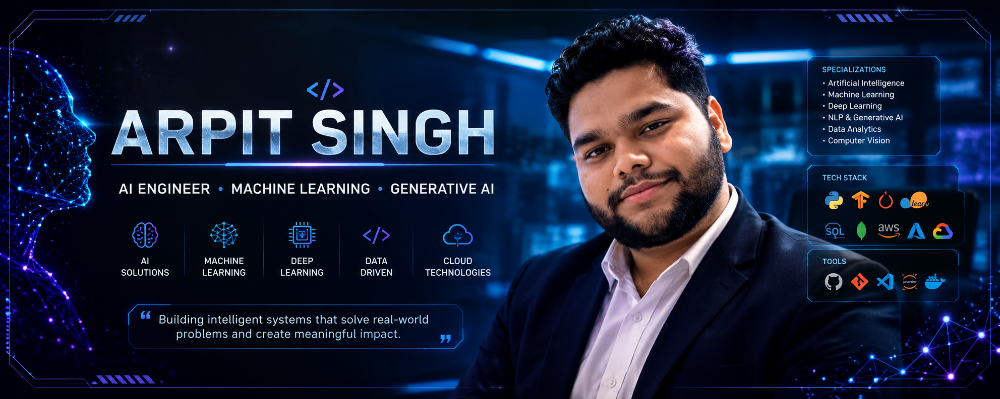
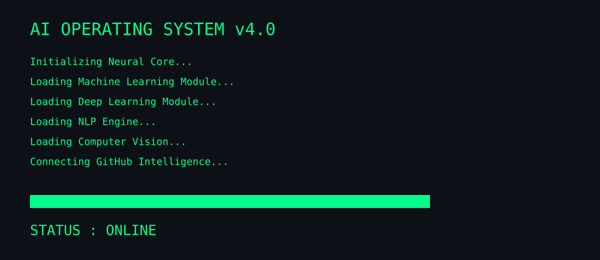

<!-- ========================================================= -->
<!--                 AI OPERATING SYSTEM                       -->
<!-- ========================================================= -->

<p align="center">



</p>

<p align="center">



</p>

<p align="center">


</p>

<p align="center">


</p>

---

<p align="center">


</p>

<!-- Identity Module -->

<!-- ========================================================= -->
<!--                 AI IDENTITY SCANNER                       -->
<!-- ========================================================= -->

<p align="center">
  
</p>

<h1 align="center">
🛰️ AI BIOMETRIC IDENTIFICATION SYSTEM
</h1>

<p align="center">
<i>Neural Identity Verification • AI Engineer Profile • Secure Access</i>
</p>

<table align="center">
<tr>

<td width="38%" align="center">


<br><br>

```text
◉ FACE VERIFIED

█████████████████

STATUS : ONLINE

AI CORE : ACTIVE

```

</td>

<td width="62%">

# 👤 Identity Report

```text
NAME        : Arpit Singh

ROLE        : Artificial Intelligence Engineer

EDUCATION   : B.Tech (Artificial Intelligence)

UNIVERSITY  : Invertis University

LOCATION    : India

MISSION     : Building Intelligent AI Systems

STATUS      : AVAILABLE FOR AI COLLABORATION
```

---

## 🎯 Current Focus

- 🤖 Generative AI
- 🧠 Machine Learning
- 📊 Data Analytics
- 👁️ Computer Vision
- 💬 Natural Language Processing
- ☁️ Cloud Deployment

---

### System Status

| Module | Status |
|---------|:------:|
| AI Core | 🟢 Online |
| Neural Engine | 🟢 Active |
| ML Models | 🟢 Running |
| GitHub Sync | 🟢 Connected |
| Learning | 🚀 Continuous |

</td>

</tr>
</table>

<p align="center">
  
</p>

---

<!-- Dashboard Module -->

<!-- ========================================================= -->
<!--                NEURAL CORE DASHBOARD                      -->
<!-- ========================================================= -->

<p align="center">

</p>

<h1 align="center">🧠 NEURAL CORE DASHBOARD</h1>

<p align="center">
<i>Artificial Intelligence Engine Status • Live Skill Matrix</i>
</p>

<div align="center">

| AI Module | Level | Status |
|-----------|:-----:|:------:|
| 🐍 Python | ███████████████████ 98% | 🟢 ONLINE |
| 🤖 Machine Learning | █████████████████ 95% | 🟢 ACTIVE |
| 🧠 Deep Learning | ████████████████ 92% | 🟢 ACTIVE |
| 💬 NLP | ███████████████ 90% | 🟢 RUNNING |
| 👁 Computer Vision | ██████████████ 88% | 🟢 READY |
| ⚡ Generative AI | ████████████████ 93% | 🟢 ACTIVE |
| 📊 Data Analytics | ███████████████ 91% | 🟢 ONLINE |
| ☁ AWS & Cloud | ████████████ 82% | 🟢 CONNECTED |
| 🌐 React.js | ████████████ 84% | 🟢 ONLINE |
| 🛢 SQL | ███████████████ 90% | 🟢 ACTIVE |

</div>

---

## ⚙️ AI Technology Stack

<table align="center">
<tr>

<td align="center">

### Programming

Python

Java

JavaScript

SQL

C++

</td>

<td align="center">

### AI / ML

TensorFlow

PyTorch

Scikit-Learn

OpenCV

LangChain

</td>

<td align="center">

### Data

Pandas

NumPy

Power BI

Excel

Matplotlib

</td>

<td align="center">

### Cloud

AWS

GitHub

Docker

Linux

VS Code

</td>

</tr>
</table>

---

## 🛰️ Neural Processing Units

```text
AI Core              ████████████████████

Machine Learning     ██████████████████

Deep Learning        █████████████████

Computer Vision      ███████████████

Natural Language     ███████████████

Generative AI        ███████████████████

Cloud Deployment     ████████████

Data Analytics       █████████████████
```

<p align="center">

</p>


---

<!-- Projects -->

<!-- ========================================================= -->
<!--                  MISSION DATABASE                          -->
<!-- ========================================================= -->

<p align="center">

</p>

<!-- ========================================================= -->

# 🚀 PROJECT MISSION DATABASE

```text
Connecting to AI Repository...

████████████████████████████

AUTHORIZED ACCESS GRANTED

Scanning AI Projects...

████████████████████████████

MISSION DATABASE ONLINE
```

> **Loading classified AI repositories...**

---

<p align="center">
<i>AI Project Intelligence • Classified Mission Files</i>
</p>

---

## # 🛰️ AI-001 | NOVA SPHERE

```text
MISSION STATUS

█████████████████████

STATUS      : ACTIVE

SECURITY    : PUBLIC

CATEGORY    : Disaster Intelligence

PRIORITY    : HIGH

```

### 🎯 Objective

Predict disasters before they happen using AI and real-time analytics.

### ⚙ Tech

`Python`
`Machine Learning`
`React`
`AWS`
`Power BI`
`SQL`

### 📡 Modules

✅ Prediction

✅ Dashboard

✅ Emergency Response

✅ Analytics

---
### Key Features
- 📍 Predictive disaster risk analysis
- 📊 Interactive analytics dashboard
- 🚨 Early warning system
- 🌍 Resource allocation support

---

## 🤖 Mission AI-002 — Sonar AI

| Field | Details |
|------|---------|
| Status | 🟢 ACTIVE |
| Category | Generative AI Assistant |
| Objective | Develop a conversational AI assistant with semantic search and contextual response generation. |
| Tech Stack | Python • LangChain • OpenAI API • Vector Database • NLP |

### Key Features
- 💬 Intelligent conversational interface
- 🔍 Semantic search capabilities
- 🧠 Prompt engineering and RAG
- ⚡ Context-aware responses

---

## 📚 Mission AI-003 — Smart Learning Management System

| Field | Details |
|------|---------|
| Status | 🟢 ACTIVE |
| Category | AI in Education |
| Objective | Create an AI-powered learning platform with personalized recommendations and analytics. |
| Tech Stack | Python • Machine Learning • React • SQL |

### Key Features
- 🎯 Personalized learning recommendations
- 📈 Student performance analytics
- 🤖 AI academic assistant
- 📊 Learning progress dashboard

---

## 🌐 Mission AI-004 — Multilingual Translation Assistant

| Field | Details |
|------|---------|
| Status | 🟢 ACTIVE |
| Category | Natural Language Processing |
| Objective | Build a multilingual translation system with speech and text processing capabilities. |
| Tech Stack | Python • NLP • SpeechRecognition • Translation APIs |

### Key Features
- 🌍 Multi-language translation
- 🎤 Speech-to-text conversion
- 🔊 Text-to-speech output
- 🧠 Context-aware language processing

---

## 📈 Mission AI-005 — Retail Sales Analytics

| Field | Details |
|------|---------|
| Status | 🟢 ACTIVE |
| Category | Data Analytics & Forecasting |
| Objective | Analyze retail sales data to generate business insights and sales forecasts. |
| Tech Stack | Python • Pandas • Scikit-Learn • Power BI |

### Key Features
- 📊 Exploratory data analysis
- 📈 Sales forecasting models
- 📉 Business performance insights
- 📋 Interactive dashboards

---

## 🚗 Mission AI-006 — Vehicle Detection System

| Field | Details |
|------|---------|
| Status | 🟢 ACTIVE |
| Category | Computer Vision |
| Objective | Develop a CNN-based vehicle detection system for real-time image processing. |
| Tech Stack | TensorFlow • OpenCV • Python • CNN |

### Key Features
- 🚘 Real-time vehicle detection
- 🎯 CNN-based image classification
- 📷 Advanced image processing
- ⚡ Efficient prediction pipeline

---

<p align="center">

</p>

---

<!-- GitHub Telemetry -->

---

# 📡 GITHUB INTELLIGENCE CENTER

```text
Connecting to GitHub API...

██████████████████████

Synchronizing Repository...

██████████████████████

Telemetry Online
```

<p align="center">


</p>

<p align="center">


</p>

---


<!-- Contact -->

# 💻 TERMINAL

```bash
root@ai-os:~$

whoami

Arpit Singh

role

Artificial Intelligence Engineer

status

Open for AI Projects & Collaboration

contact

anoop005240@gmail.com.com

github

github.com/abhirajsingh524
```

---

---

<!-- Footer -->

<p align="center">

```text
SYSTEM LOG

AI Operating System

Session Completed

Thank you for visiting.

Connection Closed.

```


</p>