<!-- ================================================================= -->
<!--         AI OPERATING SYSTEM — ARPIT SINGH GITHUB PROFILE          -->
<!--                  Neural Engine Core v4.0                           -->
<!-- ================================================================= -->

  

<!-- ===== BOOT SEQUENCE ===== -->

  

  

<!-- ===== IDENTITY HUD ===== -->

  

  
  &nbsp;
  
  &nbsp;
  
  &nbsp;
  

  

<!-- ===== NEURAL CORE DASHBOARD ===== -->

  

  

<!-- ===== TECHNOLOGY STACK ===== -->

  

  

  

  

<!-- ===== MISSION DATABASE ===== -->

  

  

<!-- ===== PROJECT DETAIL CARDS ===== -->

<table align="center" width="100%">
<tr>
<td width="50%" valign="top">

**`◉ AI-001` NOVA SPHERE** — Disaster Intelligence

> Predict disasters before they happen using AI, real-time analytics, and cloud infrastructure.

`Python` `Machine Learning` `React` `AWS` `Power BI` `SQL`

</td>
<td width="50%" valign="top">

**`◉ AI-002` SONAR AI** — Generative AI Assistant

> Conversational AI with semantic search, RAG pipeline, and context-aware response generation.

`Python` `LangChain` `OpenAI API` `Vector DB` `NLP`

</td>
</tr>
<tr>
<td width="50%" valign="top">

**`◉ AI-003` SMART LMS** — AI Education Platform

> Personalized learning with AI recommendations, student analytics, and academic assistant.

`Python` `Machine Learning` `React` `SQL`

</td>
<td width="50%" valign="top">

**`◉ AI-004` MULTILINGUAL AI** — NLP Translation

> Multi-language translation with speech-to-text, text-to-speech, and context-aware processing.

`Python` `NLP` `SpeechRecognition` `Translation APIs`

</td>
</tr>
<tr>
<td width="50%" valign="top">

**`◉ AI-005` RETAIL ANALYTICS** — Sales Forecasting

> Data-driven retail insights with ML forecasting models and interactive Power BI dashboards.

`Python` `Pandas` `Scikit-Learn` `Power BI`

</td>
<td width="50%" valign="top">

**`◉ AI-006` VEHICLE DETECT** — Computer Vision CNN

> Real-time vehicle detection using CNN architecture, OpenCV pipelines, and image classification.

`TensorFlow` `OpenCV` `Python` `CNN`

</td>
</tr>
</table>

  

<!-- ===== GITHUB TELEMETRY HUD ===== -->

  

  
  &nbsp;
  

  

  

  

<!-- ===== TERMINAL HUD ===== -->

  

  

<!-- ===== FOOTER ===== -->

  

  

