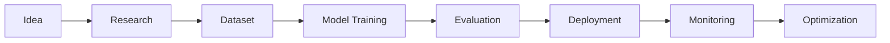

<!-- ========================================================= -->
<!--                 ARPIT SINGH GITHUB PROFILE                -->
<!-- ========================================================= -->

<div align="center">


<br>


</div>

---

<div align="center">


</div>

---

#  Hello World

```bash
root@arpit:~$ whoami
```

```text
Name        : Arpit Singh

Role        : Artificial Intelligence Engineer

Education   : B.Tech Artificial Intelligence

University  : Invertis University

Location    : India

Status      : Building Intelligent Systems

Focus       : Machine Learning | Generative AI | Data Analytics

Experience  : AI Projects | Analytics | Full Stack AI

Mission     : Creating AI products that solve real-world problems.
```

---

#  AI SYSTEM STATUS

```text
██████████████████████████████████████████████████████

SYSTEM STATUS

✔ Artificial Intelligence

✔ Machine Learning

✔ Deep Learning

✔ NLP

✔ Computer Vision

✔ Data Analytics

✔ Cloud Computing

✔ Open Source

SYSTEM HEALTH

██████████████████████████████████████████████████████

CPU Usage          ██████████████░░ 92%

Python             ███████████████ 100%

TensorFlow         ███████████████ 100%

GitHub             █████████████░░ 95%

Coffee             ███████████████ 100%

Learning           ███████████████ 100%
```

---

# 🚀 About Me


```yaml
Name: Arpit Singh

Role: AI Engineer

Specialization:
  - Machine Learning
  - Deep Learning
  - Generative AI
  - NLP
  - Computer Vision
  - Data Analytics

Programming:
  - Python
  - SQL
  - Java

Libraries:
  - TensorFlow
  - PyTorch
  - Scikit-Learn
  - Pandas
  - NumPy
  - OpenCV

Cloud:
  - AWS
  - Azure

Database:
  - MongoDB
  - MySQL

Current Goal:
  Build production-ready AI systems
```

---

# 💻 Hacker Console

```console
root@arpit:~$

$ python ai_portfolio.py

Loading Python................. OK

Loading TensorFlow............ OK

Loading PyTorch............... OK

Loading Neural Networks....... OK

Loading Computer Vision....... OK

Loading NLP................... OK

Loading AI Projects........... OK

Portfolio Loaded Successfully ✔
```

---

<div align="center">

## ⚡ "Turning Ideas into Intelligent AI Solutions"

</div>

---
<!-- ========================================================= -->
<!--                  TECH STACK & SKILLS                      -->
<!-- ========================================================= -->

<div align="center">

#  AI CORE TECHNOLOGIES


</div>

---

# 💻 Technology Matrix

<table align="center">
<tr>
<td width="50%">

## 🤖 Artificial Intelligence

- 🧠 Machine Learning
- 🔥 Deep Learning
- 💬 Natural Language Processing (NLP)
- 👁️ Computer Vision
- ⚡ Generative AI
- 🎯 Prompt Engineering
- 🔍 Model Evaluation
- 📈 Predictive Analytics

</td>

<td width="50%">

## 📊 Data Analytics

- 📊 Power BI
- 📉 Tableau
- 🐼 Pandas
- 🔢 NumPy
- 📈 Matplotlib
- 📊 Seaborn
- 🗃 SQL
- 📑 Data Visualization

</td>

</tr>
</table>

---

# 🖥️ Development Environment

```text
root@arpit:~$ neofetch

██████████████████████████████

OS          : Linux / Windows

Editor      : VS Code

Notebook    : Jupyter Notebook

IDE         : PyCharm

Version     : Git

Cloud       : AWS | Azure

Database    : MongoDB | MySQL

Language    : Python

Status      : Ready for Deployment

██████████████████████████████
```

---

# ⚙️ Programming Languages

| Language | Experience | Usage |
|----------|------------|------|
| 🐍 Python | ████████████ | AI • ML • Automation |
| 🗄 SQL | ██████████ | Analytics • Database |
| ☕ Java | ████████ | OOP • DSA |
| 💻 C | ███████ | Programming Fundamentals |

---

# 🤖 AI Frameworks

<div align="center">

| Framework | Expertise |
|------------|-----------|
| TensorFlow | ⭐⭐⭐⭐⭐ |
| PyTorch | ⭐⭐⭐⭐☆ |
| Scikit-Learn | ⭐⭐⭐⭐⭐ |
| OpenCV | ⭐⭐⭐⭐☆ |
| LangChain | ⭐⭐⭐⭐☆ |
| Pandas | ⭐⭐⭐⭐⭐ |
| NumPy | ⭐⭐⭐⭐⭐ |

</div>

---

# ☁️ Cloud & DevOps

<div align="center">


</div>

```text
Deployment Status

AWS          ██████████░░ 85%

Azure        ████████░░░░ 70%

Docker       ███████░░░░░ 60%

Git          ████████████ 95%

Linux        █████████░░░ 80%
```

---

# 📂 Databases

<div align="center">


</div>

| Database | Purpose |
|----------|---------|
| MongoDB | NoSQL Applications |
| MySQL | Relational Database |
| SQL | Data Analysis |

---

# 🚀 Development Workflow



---

# 🎯 Current Learning

```text
Loading Learning Modules...

██████████████████████████████

✔ Large Language Models

✔ AI Agents

✔ Retrieval Augmented Generation

✔ MLOps

✔ Kubernetes

✔ Cloud AI

✔ Multi-Agent Systems

██████████████████████████████

Status : Learning Never Stops 🚀
```

---

<div align="center">

## 💚 "Code • Learn • Build • Repeat"

</div>

---
<!-- ========================================================= -->
<!--                  FEATURED PROJECTS                        -->
<!-- ========================================================= -->

<div align="center">

# 🚀 Featured AI Projects

### *Building Intelligent Systems for Real-World Applications*


</div>

---

# 🌍 Nova Sphere

> **AI-Powered Disaster Management Platform**


### 📌 Overview

Nova Sphere is an AI-driven disaster management platform designed to improve emergency preparedness through predictive analytics, real-time monitoring, and intelligent decision support.

### ✨ Key Features

- 📍 Disaster Risk Prediction
- 📊 Interactive Analytics Dashboard
- 🚨 Early Warning & Alerts
- 🌍 Resource Allocation Support
- ☁️ Cloud-Ready Architecture

### 🛠 Tech Stack

`Python` `Scikit-Learn` `Pandas` `SQL` `React` `Power BI` `AWS`

---

# 🤖 Sonar AI

> **Generative AI Assistant**


### 📌 Overview

A conversational AI assistant that leverages Large Language Models to provide context-aware responses and semantic search capabilities.

### ✨ Key Features

- 💬 Intelligent Conversations
- 🧠 Prompt Engineering
- 🔍 Semantic Search
- 📚 Retrieval-Augmented Generation (RAG)
- ⚡ Fast Response Pipeline

### 🛠 Tech Stack

`Python` `LangChain` `OpenAI API` `Vector Database` `NLP`

---

# 📚 Smart Learning Management System

> **AI-Based Learning Platform**


### 📌 Overview

A smart education platform that personalizes learning experiences using AI-powered recommendations and student performance analytics.

### ✨ Key Features

- 📈 Student Performance Dashboard
- 🎯 Personalized Learning
- 🤖 Academic AI Assistant
- 📊 Learning Analytics

### 🛠 Tech Stack

`Python` `Machine Learning` `React` `SQL`

---

# 🌐 Multilingual Translation Assistant

> **NLP-Based Language Translation System**


### ✨ Features

- 🌍 Multi-language Support
- 🎤 Speech-to-Text
- 🔊 Text-to-Speech
- 🔍 Language Detection
- 🧠 Context-Aware Translation

### 🛠 Tech Stack

`Python` `NLP` `SpeechRecognition` `Translation APIs`

---

# 📈 Retail Sales Analytics

> **Business Intelligence & Sales Forecasting**


### 📌 Highlights

- 📊 Exploratory Data Analysis
- 📈 Sales Forecasting
- 📉 Business Insights
- 📋 Interactive Dashboards

### 🛠 Tech Stack

`Python` `Pandas` `Scikit-Learn` `Power BI`

---

# 🚗 Vehicle Detection System

> **Computer Vision using Deep Learning**


### 📌 Features

- 🚘 Vehicle Detection
- 🎯 CNN-Based Model
- 📷 Image Processing
- ⚡ Real-Time Prediction

### 🛠 Tech Stack

`TensorFlow` `OpenCV` `Python` `CNN`

---

# 📊 Project Summary

| Project | Domain | Status |
|----------|--------|--------|
| 🌍 Nova Sphere | AI + Analytics | ✅ Completed |
| 🤖 Sonar AI | Generative AI | ✅ Completed |
| 📚 Smart LMS | AI in Education | ✅ Completed |
| 🌐 Translation Assistant | NLP | ✅ Completed |
| 📈 Retail Analytics | Data Analytics | ✅ Completed |
| 🚗 Vehicle Detection | Computer Vision | ✅ Completed |

---

<div align="center">

## 💡 *"Every project is an opportunity to learn, innovate, and solve real-world problems through Artificial Intelligence."*

</div>

---
<!-- ========================================================= -->
<!--              GITHUB DASHBOARD & ACHIEVEMENTS              -->
<!-- ========================================================= -->

<div align="center">

# 📊 GitHub Analytics Dashboard


</div>

---

<div align="center">

## 🔥 Contribution Streak


</div>

---

<div align="center">

## 🏆 GitHub Trophies


</div>

---

<div align="center">

## 📈 Contribution Graph


</div>

---

<div align="center">

## 🐍 Contribution Snake

> *(This will work after adding the GitHub Action in Part 5.)*


</div>

---

# 🏅 Certifications

| Certification | Status |
|---------------|--------|
| Microsoft AI / ML | ✅ |
| IBM Python | ✅ |
| AWS Educate | ✅ |
| AICTE Internship | ✅ |
| IEEE / Technical Learning | ✅ |

> *Add the exact certificate names and links later.*

---

# 🏆 Achievements

- 🧠 Built multiple AI/ML projects covering NLP, Computer Vision, Analytics, and Generative AI.
- 🚀 Developed end-to-end applications using Python, Machine Learning, and modern AI frameworks.
- 📊 Strong interest in solving real-world problems through data-driven solutions.
- 🌱 Continuously learning advanced AI concepts such as LLMs, RAG, AI Agents, and MLOps.

---

# 🎓 Education

```text
Bachelor of Technology (B.Tech)
Artificial Intelligence

Invertis University
2023 – 2027

Focus Areas
• Machine Learning
• Deep Learning
• Data Analytics
• Generative AI
```

---

# 🎯 Currently Learning

```text
██████████████████████████████

✔ Large Language Models (LLMs)

✔ Retrieval-Augmented Generation (RAG)

✔ AI Agents

✔ MLOps

✔ Cloud AI

✔ Advanced Deep Learning

██████████████████████████████
```

---

# 📅 2026 Goals

- 🚀 Build production-ready AI applications
- 🌍 Contribute to open-source AI projects
- 📖 Publish technical blogs
- ☁️ Strengthen cloud deployment skills
- 💼 Secure an AI/ML internship or full-time opportunity

---

# 🌐 Connect With Me

<div align="center">

<a href="https://github.com/abhirajsingh524">

</a>

<a href="https://www.linkedin.com/">

</a>

<a href="mailto:your-email@example.com">

</a>

</div>

> Replace the LinkedIn profile URL and email address with your own.

---

<div align="center">

## 💻 Hacker Terminal

```bash
root@arpit:~$

$ git status

On branch main

Portfolio Status : ACTIVE

AI Projects : READY

Learning : NEVER STOPS

Next Goal : Build AI that creates real-world impact.

System Exit...

Connection Closed.

Thanks for visiting! 🚀
```

</div>

---